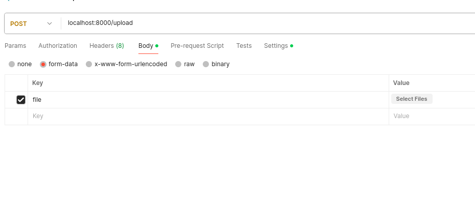

# Video Processor (MP4 to HLS Conversion)

This project is a simple Node.js server built using Express, which allows users to upload MP4 videos and converts them into HLS (HTTP Live Streaming) format (M3U8 and .ts segments) using FFmpeg. The videos can then be streamed on a frontend using the `video.js` library.

## Features
- Upload MP4 video files to the server.
- Convert MP4 video files to HLS format using FFmpeg.
- Serve the HLS files as streams via an Express API.
- Frontend video player using Video.js to play the HLS stream.

## Technologies Used
- **Node.js** with **Express** for the backend server.
- **Multer** for handling file uploads.
- **FFmpeg** for converting MP4 files to HLS format.
- **React** with **Video.js** for the frontend video player.

## Requirements
- **Node.js** and **npm** (or **yarn**) should be installed on your machine.
- **FFmpeg** must be installed and available in your system’s PATH.
- Linux-based OS (tested on Debian-based systems).

## Getting Started

### Installation

1. Clone the repository:
   ```bash
   git clone https://github.com/your-username/video_processor.git
   cd video_processor
npm install
# On Debian/Ubuntu-based systems
sudo apt update
sudo apt install ffmpeg
run server 

